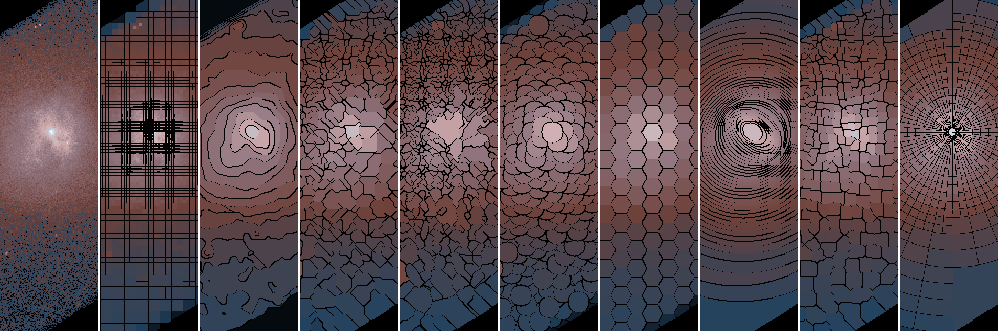

# Adaptive Binning Routines

This repo contains several adaptive binning routines for use in 
[CIAO](http://cxc.cfa.harvard.edu/ciao).  These include

- `contour_map` : follows local contours
- `dragon_scales` : overlapping shapes
- `grow_from_max` : watershed tesselations
- `hexgrid` : regular hexagonal grid
- `mkregmap` : stack of regions to a map
- `pathfinder` : steepest ascent

This repro was forked from my
[Temperature Map](https://github.com/kglotfelty/TemperatureMap) repro.

Users may also be interested in the compiled tools

- [`dmnautilus`](https://github.com/kglotfelty/dmnautilus-) (upgraded from CIAO version)
- [`dmradar`](https://github.com/kglotfelty/dmradar) 
